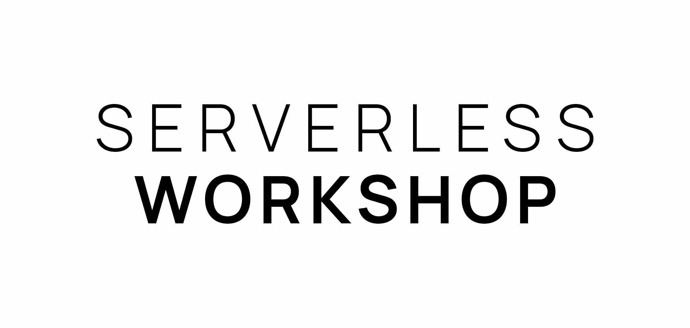

<p align="center">
  
</p>

<h4 align="center">A workshop for demonstrating the power of GraphQL and Serverless.</h4>

<p align="center">
  <!-- ALL-CONTRIBUTORS-BADGE:START - Do not remove or modify this section -->
[](#contributors-)
<!-- ALL-CONTRIBUTORS-BADGE:END -->
</p>

<p align="center">
  <a href="#quick-start">Quick Start</a> •
  <a href="#">Documentation</a> •
  <a href="#contributors-✨">Credits</a> •
  <a href="#license">License</a>
</p>

## Quick Start

The easiest way to get up and running is to run

```sh
npm i
npm start
```

This will create a server for you at [localhost:3000/graphql](http://localhost:3000/graphql)

## Contributors ✨

Thanks goes to these wonderful people ([emoji key](https://allcontributors.org/docs/en/emoji-key)):

<!-- ALL-CONTRIBUTORS-LIST:START - Do not remove or modify this section -->
<!-- prettier-ignore-start -->
<!-- markdownlint-disable -->
<table>
  <tr>
    <td align="center"><a href="https://github.com/AJHenry"><br /><sub><b>Andrew</b></sub></a><br /><a href="https://github.com/AJHenry/serverless-workshop/commits?author=AJHenry" title="Documentation">📖</a> <a href="https://github.com/AJHenry/serverless-workshop/commits?author=AJHenry" title="Code">💻</a></td>
    <td align="center"><a href="https://github.com/nicksmider"><br /><sub><b>Nicholas Smider</b></sub></a><br /><a href="https://github.com/AJHenry/serverless-workshop/commits?author=nicksmider" title="Documentation">📖</a> <a href="https://github.com/AJHenry/serverless-workshop/commits?author=nicksmider" title="Code">💻</a></td>
  </tr>
</table>

<!-- markdownlint-restore -->
<!-- prettier-ignore-end -->

<!-- ALL-CONTRIBUTORS-LIST:END -->

This project follows the [all-contributors](https://github.com/all-contributors/all-contributors) specification. Contributions of any kind welcome!

## License

[MIT](LICENSE.md)
