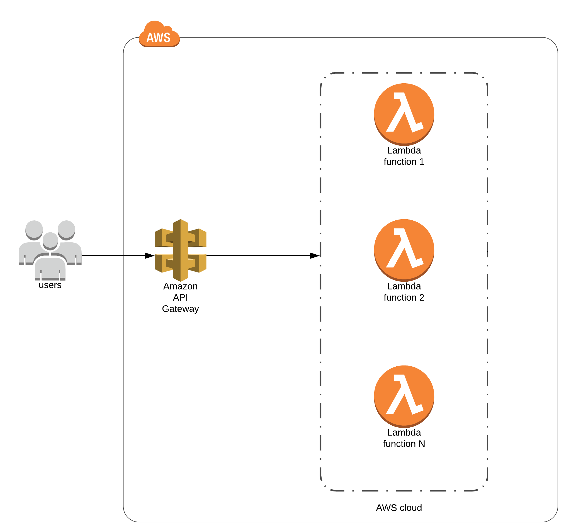

# Deploying your Code

This guide will walk you through deploying your code to AWS

## AWS

This guide is going to provide everything you need to deploy this codebase to Google Cloud and let it listen to HTTP requests

This project already has the files you need for serverless framework and CloudFormation to work properly.

Everything used should fall under the free tier of AWS, but it is best practice to make sure you set a billing alert so there are no unexpected charges to your account.

### Setting up your AWS account
1. [Setup AWS Account](https://aws.amazon.com/premiumsupport/knowledge-center/create-and-activate-aws-account/)
   a. [Set up billing alert](https://docs.aws.amazon.com/AmazonCloudWatch/latest/monitoring/monitor_estimated_charges_with_cloudwatch.html)

2. [Create a new IAM user with programmatic access](https://docs.aws.amazon.com/IAM/latest/UserGuide/id_users_create.html#id_users_create_console)
   a.  Save the Access Keys for the account 
3. [Configure AWS on your local machine](https://docs.aws.amazon.com/cli/latest/userguide/cli-configure-quickstart.html)


### Pre-requisites

We use serverless framework to deploy things

```bash
npm i -g serverless
```

Navigate to the project directory and install dependencies.

```bash
npm i 
```

Test locally before deploying

```bash
npm run start
```

Check the playground at `localhost:3000`

### Deploying

```bash
serverless deploy
```

You should see output that resembles this:

```bash
Serverless: Stack update finished...
Service Information
service: aws-apollo-lambda
stage: dev
region: us-east-1
stack: aws-apollo-lambda-dev
resources: 13
api keys:
  None
endpoints:
  POST - https://<uniqueID>.execute-api.us-east-1.amazonaws.com/dev/graphql
  GET - https://<uniqueID>.execute-api.us-east-1.amazonaws.com/dev/graphql
functions:
  graphql: aws-apollo-lambda-dev-graphql
layers:
  None
```

### Architecture

Serverless will deploy multiple AWS services as part of a [CloudFormation](https://aws.amazon.com/cloudformation/) template.

You can  invoke the lambda and view the deployed lambda using the endpoints that serverless gives you: `https://<uniqueID>.execute-api.us-east-1.amazonaws.com/dev/graphql`

This is an [API Gateway](https://aws.amazon.com/api-gateway/) endpoint that will invoke the lambda `aws-apollo-lambda-dev-graphql`.

<p align="center">
  
</p>

### Tear Down

It's a good idea to remove deployments that you do not intend to keep up. This can be down easily with serverless.

```bash
serverless remove
```

Verify the removal in AWS Console. 

[Official Docs](https://www.serverless.com/framework/docs/providers/aws/guide/deploying/)
