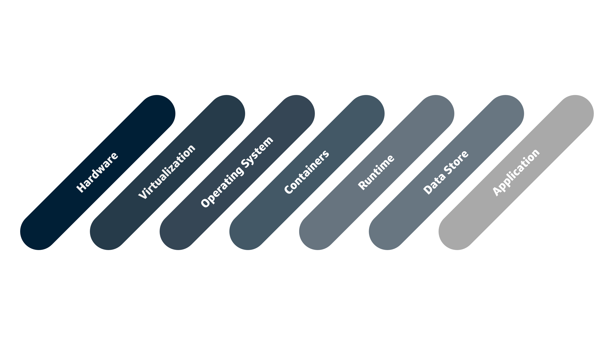
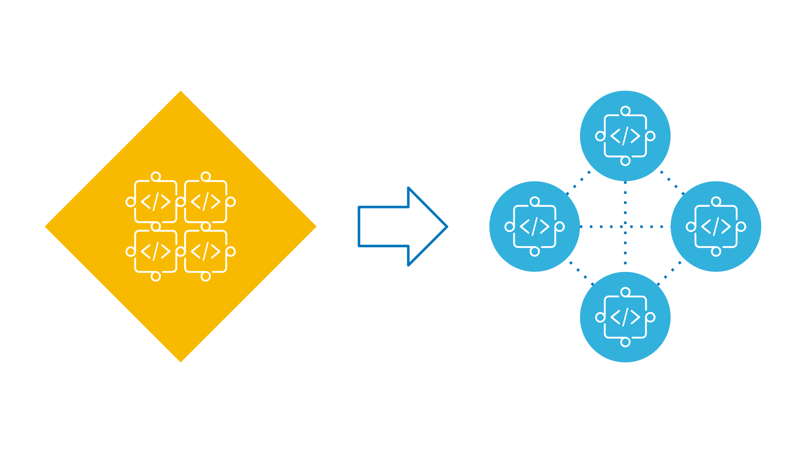

# Serverless Concepts

## Architectural Background

Before talking about what serverless is, we need to understand the traditional architecture stack. There are many layers to this, as can be seen in the image above. At the lowest level, there is the hardware of the server; layers are added all the way to the application layer. There are a few different ways of representing this architecture, with more or less granularity, but this gives a pretty good picture of the different elements at play.

## What is Serverless?

With the rise of the cloud, different service paradigms have risen in popularity. These services serve to abstract away certain elements of the architecture stack. Traditional data centers manage the entire architecture from hardware to application, which gives the largest possible control but is also the least agile. On the other side of the spectrum exists serverless computing, otherwise known as Function as a Service. Serverless allows for the least configurability but the highest agility, with only application management left to you.

## How Does It help?

By removing the need to manage everything but your code, Serverless helps reduce sysops overhead and speeds up development cycles. Serverless architecture also makes it easier to decompose monolithic applications into microservices for increased agility. Instead of having a single compute server running your entire application stack, multiple serverless applications will each handle separate functions, allowing you to target individual component deployments.